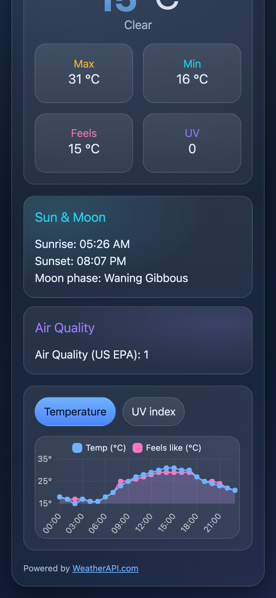

# Meteo One (Vanilla JS)

<p align="center">
  <a href="https://meteo-one-blaszczakdevs-projects.vercel.app">
    
  </a>
  &nbsp;
  
  &nbsp;
  
  &nbsp;
  
  &nbsp;
  
</p>

**Meteo One** is a mobile-first weather application built with plain **HTML/CSS/JS**.  
It shows current conditions, hourly forecast, astronomy and air quality data, and visualizes metrics with **Chart.js** for a clear, modern UX.

---

## ✨ Features

- 🔍 City search or geographic coordinates input
- 📍 "Use my location" via browser Geolocation API
- 🕒 Last searched location chip (persisted in `localStorage`)
- 🌡️ Detailed metrics: temperature, feels-like, min/max, UV index, air quality, astronomy (sunrise, sunset, moon phase)
- 📊 Hourly charts (temperature vs. feels-like, UV index) powered by Chart.js
- ⚠️ Robust error handling (invalid input, API errors, rate limit, network issues)
- 🎨 Mobile-first dark theme, CSS variables, responsive breakpoints

---

## 📸 Screenshots

### Desktop

<p align="center">
  
</p>

### Mobile

<p align="center">
  
  
</p>

---

## 🧱 Tech Stack

- Vanilla JavaScript (ES modules)
- Chart.js (via CDN)
- WeatherAPI.com `forecast.json` endpoint
- CSS (custom, mobile-first, variables + breakpoint overrides)
- Vite (for local dev + environment injection)

---

## 📂 Project structure

.
├── index.html  
├── public/  
│ └── css/  
│ ├── reset.css  
│ ├── variables.css  
│ ├── main.css  
│ ├── tablet.css (≥768px)  
│ ├── laptop.css (≥1024px)  
│ └── desktop.css (≥1280px)  
└── src/  
 ├── apiService.js → WeatherAPI client + response shaping  
 ├── DOMActions.js → DOM id mapping helper  
 └── main.js → App logic, state, rendering, charts

---

## 🚀 Getting Started

**Prerequisites**: Node.js + npm

```bash
npm install
npm run dev
```

Build & preview production:

```bash
npm run build
npm run preview
```

Then open the local or preview URL (e.g. `http://localhost:5173`).

---

## 🔑 Environment Variables (for developers)

The API key is read in `src/apiService.js` from `import.meta.env.VITE_WEATHER_API_KEY`.

Create a `.env.local` in the project root:

```
VITE_WEATHER_API_KEY=your_weatherapi_key_here
```

- Get a free key at [WeatherAPI.com](https://www.weatherapi.com/).
- Restart dev server after editing env files.
- Restrict the key by referrer domain in your WeatherAPI account (since this is a client-side app).

---

## 📝 Usage

- Enter a city name or coordinates → press **Enter** or click **Search**
- Click **Use my location** to fetch via geolocation
- Use the **last location** chip for quick reload
- Switch between **Temperature** and **UV** charts

---

## 📄 License

MIT
